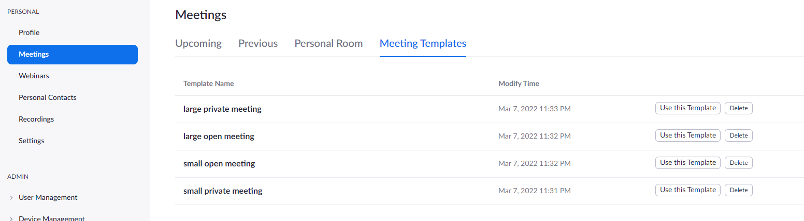
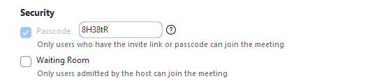

# zoom etiquette

- [Introduction](#introduction)
- [Guests - Before you join](#guests---before-you-join)
    - [Your Profile](#your-profile)
    - [Webcam Settings](#video-and-webcam-settings)
    - [Audio Settings](#audio-settings)
- [Guests - After you join](#guests---after-you-join)
- [Hosts - Before you host](#hosts---before-you-host)
    - [Meeting Templates](#meeting-templates)
    - [Respecting Guest Privacy](#respecting-guest-privacy)
    - [Waiting Rooms](#waiting-rooms)
    - [Pre-Start Slides](#pre-start-slides)
- [Hosts - Hosting a meeting](#hosts---hosting-a-meeting)
- [Other Notes & Links](#notes-and-links)

   
  
## Introduction
---

The advent of covid has created a world of video conferencing that many of us didnt know existed.

For digital natives, configuring zoom and zoom meeting etiquette will be second nature. Many people however dont have exposure or experience with video conferencing technology and therefore wont even think twice about appropriate configuration or zoom etiquette.

This guide is intended to be a basic, albeit opinionated, guide to zoom etiquette.

It is broken down into two main sections:

- Meeting attendees (or guests)
- Meeting hosts (including co-hosts)

As I mentioned previously this is an opinionated guide, not "The 10 Commandments of Zoom". Use all of these suggestions, or use none of them, the choice is yours.

The intention here is get people thinking about how they might be a polite guest and a facilitating host.

   

## Guests - Before you join
---

The following items highlight a few things that you might want to set before you join a meeting. Nearly all of these settings can be changed during a meeting, but if you have a few minutes before your meeting starts, then why not take a few minutes to configure the basics

  

### **Your Profile**

On the zoom desktop client:

- Open Zoom and logim
- in the main zoom window, click on the profile icon in the top right corner
- from drop menu select "My Profile"
- zoom will open a browser window with your zoom profile page
- click the "Edit" button

Note that all you _really_ need to fill in here is your display name, but if you want to add more details, you are welcome to do so.

If you have never used zoom before, (or are using on a new device) and you really need to just get into a meeting, simply enter an appropriate display name when you join the meeting.

  

### **Video and Webcam settings**

You can configure your webcam settings after logging in to zoom:

- Open Zoom and logim
- in the main zoom window, click on the gear icon below the profile icon in the top right corner
- on the right, select the "Video" tab

Adjust settings as desired. Here are some suggestions:

- Always choose the best camera you have available.
- Select "Always display participant names on their video" - you'll never forget names again!
- Select "Always turn off my video when joining meeting" - you (and you alone) should decide when your webcam is enabled.
- Select "Enable stop incoming video feature" - if you need to, this allows you right click on the zoom window and stop all incoming video. This may save you precious bandwidth.

  

### **Audio Settings**

You can configure your webcam settings after logging in to zoom:

- Open Zoom and login
- in the main zoom window, click on the gear icon below the profile icon in the top right corner
- on the right, select the "Audio" tab

Test your audio devices (both speaker and microphone) using the settings provided. You'll want to make sure you can hear clearly, and that your voice is clear when you speak. If you are using a laptop, and are alone, a headset will almost always provide better quality than your laptops built in devices.

Most computers today should be capable of supressing background noise with no real performance penalty, so enable that if you need to (Note that if you are in a quiet room with the door closed, you probably wont need this).

Adjust other settings as desired. Here are some suggestions:

- Select "Automatically join audio by computer when joining a meeting"
- Select "Mute my microphone when joining a meeting" - you (and you alone) should decide when your microphone is enabled
- Select "Press and hold SPACE key to temporarily unmute" - this is a quick shortcut that will save you searching for the unmute button.

   

## Guests - After you join
---

After you join the meeting, there are a few general guidlines to follow:

- unless you are talking, remain muted. this prevents unwanted noises from leaking into the meeting, which will affect everyone on the call (does the whole meeting really need to hear you slurping on your cup of tea or sending sms's).
- use the [spacebar shortcut](#audio-settings) to quickly unmute/mute
- turning off your video will save both yourself (and others) precious bandwidth. if you are presenting or asking a question, turn it on, but remember to turn it off afterward.
- reactions: there are some generic reactions that can provide non-audible feedback the host, use them! they provide a non-audible way to communicate with your host - asking questions, thumbs up, etc. 

Other than than, general conversation etiquette applies:

- one person speaks at a time
- if you have a question or something to say and cant get a word in edgeways, use the "raise hand" reaction a chat message
- dont shout or raise your voice - it will likely result in your ejection from the meeting.
- dont share content/screens without asking: "can i share my screen?"

For larger meetings (25+):

- dont try to have a private conversation in a public forum. If you really need to tell Rita about what Janet did at bingo that day, zoom her after the meeting.
- only comment/chat publicly when asked. Often chat is reserved for asking questions and legitmate questions can easily get lost amongst comment spam.

   

## Hosts - Before you host
---

The following items highlight a few things you will want to ensure you have sorted before your meeting starts. In addition to facilitating discussion or presenting on a topic, a good zoom host should seek to minimize wasted time due to technical issues (make sure you have tested everything you are going to use), and respect their guests privacy.

  

### **Meeting Templates**

Use [meeting templates](https://support.zoom.us/hc/en-us/articles/360036559151-Meeting-templates) to aid in managing a suitable meeting presets.

This will allow you to schedule meeting with the specific settings you need quickly and reliably.

You might consider creating templates for various senarios:

  

### **Meeting ids**

In nearly all cases you will want to generate a meeting id automatically. Using a generated meeting id will reduce the likelyhood of being zoom bombed, or eliminate the possibility of people clicking an "old" meeting link and joining a current meeting (much of this is also mitigated by using passcodes (as discussed below))

  

### **Security**

ALWAYS use passcodes for your meeting. this will prevent random internet citizens from randomly connecting to your meeting (this is colloquially known as zoom bombing).

Dont bother trying to be clever by setting a passcode that is relevant to your meeting (the passcode is encoded into meeting link, so no-one will see it). Just use the randomly generated one and share the meeting link.

Note: The meeting passcode is embedded in the meeting link so sharing zoom meeting links publicly can still result in someone zoom bombing you.

**Waiting Rooms**: for smaller meetings, waiting rooms can add meeting management overhead that is simply not required.

- is there really any harm in my guests being able to converse before the meeting starts?
- meeting content: if any of these conditions are met, screening guests using the waiting room is probably wise.
  - is the content of this meeting confidential?
  - is the content of the meeting sensitive?
  - could unmediated discussion on the subject devolve into poor/disruptive behavior?
  - is there a requirement to track or monitor attendees (eg: ensuring a quorum, or holding vote)?

After your meeting has started, you can "lock" the meeting room to prevent more people joining. 

If the meeting link has not been publicly shared and passcode has been set, the chances of being zoom bombed is quite low.

If your meeting does need a waiting room, and you expect a lot of people (25+) organise a co-host.

  

### **Respecting guest privacy**

When you plan or schedule your meeting, respect your guest's privacy.

Use the following options to allow guests to turn on their webcam and audio when they are ready to do so:

- Video - Host: Off
- Video - Guest: Off

If you want your guests to turn on their video, ask them to do so. 

  

### **Sharing Media**

Zoom has a number of settings for sharing - desktops, windows, audio, video, files.

Familiarise yourself with these setting before your host your meeting.

Test the audio sharing options and determine which will be best for you.

Consider using a co-host to manage sharing of audio/video content.

- [Zoom: Sharing and playing a video](https://support.zoom.us/hc/en-us/articles/360051673592-Sharing-and-playing-a-video)
- [Zoom: Sharing computer sound](https://support.zoom.us/hc/en-us/articles/201362643-Sharing-computer-sound-in-a-screen-share)
- [Zoom: Audio and Video](https://support.zoom.us/hc/en-us/categories/201137166-Audio-and-Video)

  

### **Co-Hosts**

If you are hosting a large meeting (25+, or if you are intending to use breakout rooms), organise a co-host.

Co-hosts should be responsible for:

- admitting people to the meeting (if it is not an open meeting)
- managing breakout rooms
- muting unintentionally disruptive guests. if you have muted someone, it is always courteous to let them know with a private message "hi there, you've been muted because there was heaps of background noise from your mic. remember to to unmute yourself before you talk again, thanks!"
- muting intentionally disruptive guests. Have a plan on how to handle disruptive guests before your meeting. Genrally intentional disruption should not be tolerated, and guests that are intentionally disruptive should be immediately ejected. More details on managing disruptive guests can be found [here](https://blog.zoom.us/keep-uninvited-guests-out-of-your-zoom-meeting).
- if questions are being taken via chat, co-hosts should be responsible for collating these and then directly messaging them to the host, rather than the host having to scroll through pages of chat messages.

Tips:

- use the participant list to identify disruptive guests
- have some pre-typed messages that you can copy-pasta into chat messages
  - "i've muted you because..."
  - "please save questions for the end..."
  - "please remember to mute/turn off webcam..."

  

### **Pre-start slides**

Particularly in large meetings, consider starting your meeting with a slide that outlines how guests should interact with the host. The following question should be answered.

- should guests have their video on or off?
  - only when talking?
  - always?
  - at their own discretion?
- can guests ask questions any time? or at the end?
  - using the mic, verbally?
  - using a public chat message?
  - using a private chat message to co-host?
  - using the "raise hand" reaction?
- encourage use of reactions/non-verbal communication where appropriate.

Put the slide up a minute or two before you intend to start, leave it up for a minute or two after you start, or until you have spent 30 seconds talking about it.

Guests that dont follow the guidelines can be politely reminded privately by co-hosts.

  

### **Check your setup**

Before you host your meeting:

- are you displaying content behind you? check it, you may need to mirror your video for it to be displayed correctly
- check that you have a reliable power source, mobile devices not connected to a charger are suboptimal
- use the best hardware you have:
  - prefer a laptop (with charger) over a mobile device
  - prefer a dedicated webcam/camera over a built in webcam
  - prefer a dedicated microphone/headset over a built in audio-device
  - prefer a network cable over a wifi/wireless connection
    - 4g/5g may be an exception here but NOT if you are hosting a large meeting.
- if you have any concerns, do a test run with your co-host
- if sharing content:
  - should this be managed by a co-host
  - familiarise yourself with screen and audio sharing options
  - test audio sharing options
  - does your share need to be optimised for video or audio

   

## Hosts - Hosting a meeting
---

When you are hosting or co-hosting a meeting, there are a few general guidlines to follow:

- respect your guests privacy: never turn on a guests microphone or webcam without explicit permission to do so. if you must, ask verbally or using chat before doing so.
- use a pre-start/intro slide
- if host becomes unavailable for any reason, the co-host should provide feedback to the audience, and if capable, step in until the host returns.
- allow appropriate time
    - did you say you would take questions? make sure you give people an opportunity to ask
- treat everybody as equal
    - everyone deserves their say, and its your job as host to faciliate that as best you can
- dont tolerate disruptive or bad behaviour
    - adopt a zero tolerance policy for disruptive/bad behavior and stick with it
    - alternatively, communuicate clear consequences: "this item has already been discussed at length and your objections have been noted. if you do not allow this meeting to continue, you will be ejected from the meeting."

   

## Other Notes
---

### **Bandwidth**

Zoom is designed to work in low-bandwidth environments. When you host or join a meeting, the
Zoom client will run a number of checks in order to maintain consistent/stable connection.

However, there still things you can do to improve your meeting experience in low bandwidth situations:

- disable HD video. Lower quality video = less bandwith  (this can turned off in [Webcam Settings](#webcam-settings))

- disable your video feed - turn off your video to reduce the amount of bandwidth required for your meeting. Dont forget, this is not just you, it affects everyone in the meeting. A meeting with 100 people all sending video will consume significantly more bandwidth than a meeting with one host sharing video.

- If your internet connection is struggling to keep up, consider using the ["stop all incoming videos" feature](https://support.zoom.us/hc/en-us/articles/4409500570381-Stopping-all-incoming-video-in-a-meeting-or-webinar). Note this will only affect your view of the meeting, while others are unaffected and unaware.

- plan your meeting to accomodate low bandwith users. for example, if you need to go around the virtual room for introductions, ask people to share their video while they introduce themselves and then turn off video afterward. 

   

### **Sources**

Many of these settings and options are documented on the [zoom website](https://support.zoom.us/hc/en-us)
